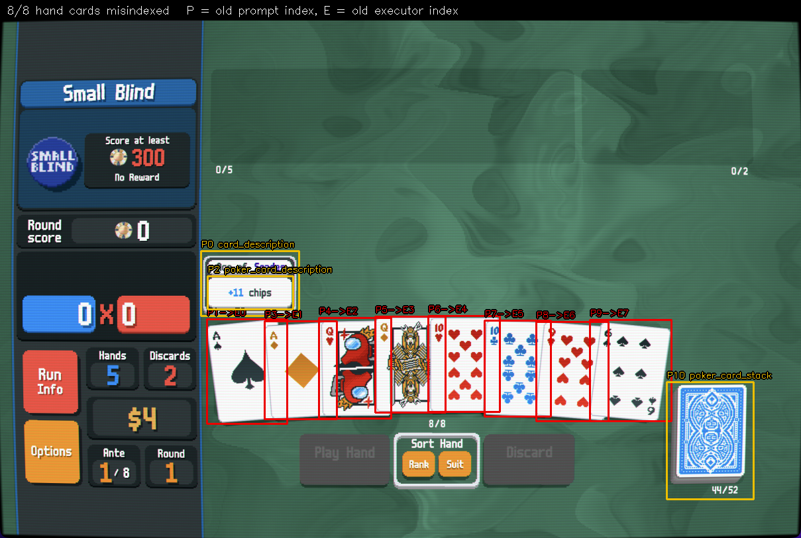

---
{
  "title": "Hand Card Index Divergence Between Prompt and Executor",
  "date": "2026-09-22",
  "coding_agents": {
    "authors": [
      "wrayx",
      "Claude Code"
    ],
    "project": "proj-airi/game-playing-ai-balatro",
    "context": "Two independent card filters gave the LLM and the click path different index spaces",
    "technologies": [
      "YOLO",
      "OpenCV",
      "mss",
      "Quartz"
    ]
  },
  "tags": [
    "detection",
    "correctness",
    "balatro",
    "methodology"
  ]
}
---

# Hand Card Index Divergence Between Prompt and Executor

## Executive Summary

- The prompt builder and the action executor each carried their own card filter. They
  disagreed, so the index the LLM reasoned about was not the index the mouse clicked.
- Live on a Small Blind hand: **8 of 8 hand cards misindexed, in all 105 captured frames**.
- Trigger is the hover tooltip, which the pipeline raises *deliberately* before every
  decision (`hover_before_action=True`). This was the normal operating state.
- Static dataset frames showed only 2 of 40 misaligned and **actively misled** the
  investigation. Training captures have no hover sweep running, so the triggering
  condition is structurally absent from them.
- Fixed by routing all card classification through `ai_balatro.core.entities`.

## Figure



Red boxes are real hand cards, labelled `P<old prompt index> -> E<old executor index>`.
Yellow boxes are entities the prompt filter wrongly counted as hand cards.

## The two filters

| | filter | classes admitted |
| --- | --- | --- |
| Prompt (`_build_base_state`) | `'card' in name and 'tooltip' not in name` | all 10 — every class name contains `card`, and the `tooltip` guard never fires because the description classes are named `*_description` |
| Executor (`CardPositionDetector`) | whitelist minus `description`/`back` | `poker_card_front`, `joker_card`, `tarot_card`, `planet_card`, `spectral_card` |

Both sorted left to right by `bbox[0]`, so any admitted non-card sitting left of a real
card shifted every index after it.

## What the dataset said, and why it misled

`cli/diagnose-entity-classes.py` over 40 training frames:

```
Frames holding a hand      : 22
Frames MISALIGNED          : 2/22
Phantom rows shown as hand : 110
Jokers misfiled as hand    : 29
```

Only 2 misaligned, both single-card transition frames with a `poker_card_back` to the
left. The reason misalignment looked rare: `poker_card_stack` sits at x≈1500–2065, to the
*right* of the hand, so it padded the tail where no real card lives. `card_description`
appeared in 5 frames and never once alongside a hand.

That last fact is the trap. These are training captures — nobody was hovering a card when
they were taken, so the tooltip that causes the bug cannot appear over a hand in them. The
measurement was not wrong, it was **inapplicable**, and it was taken as exonerating.

## What the live capture showed

One frame, mid Small Blind, tooltip raised over the leftmost card:

```
all detections : card_description@303, poker_card_front@312, poker_card_description@313,
                 poker_card_front@399, poker_card_front@481, poker_card_front@566,
                 poker_card_front@646, poker_card_front@731, poker_card_front@809,
                 poker_card_front@890, poker_card_stack@1006

old prompt     : 0:card_description  1:front  2:poker_card_description  3:front  4:front ...
old executor   : 0:front             1:front  2:front                   3:front  ...
fixed hand     : 0:front@312 1:front@399 2:front@481 ... 7:front@890
```

A single visible tooltip fires **two** detections, `card_description` and
`poker_card_description`, and both sort ahead of the leftmost card at x=312. The hand
therefore shifts by two positions from the second card onward.

All 105 frames in the burst reported `cards_shifted=8`.

### Concrete failure

The hand was A♠ A♦ Q♥ Q♠ 10♥ 10♣ 9♥ 6♠. The LLM sees its pair of Aces at prompt indices
**1 and 3** and emits `play_cards(indices=[1, 3])`. The executor's indices 1 and 3 are
**A♦ and Q♠**. It plays Ace-high instead of a pair, and burns one of four hands.

## Fix

`src/ai_balatro/core/entities.py` holds the single taxonomy — hand / joker / consumable /
description / pile / pack — matching exactly on the lowercased class name rather than by
substring. The prompt builder, `CardPositionDetector` and `CardTooltipService` all derive
their sets from it, so the two index spaces are identical by construction. An unrecognised
class is excluded and warned about once, so a retrained model fails loudly instead of
silently corrupting indices.

Regression coverage in `tests/test_entities.py` asserts that tooltips, jokers and the deck
pile do not shift hand indices, and that the executor filter equals the taxonomy.

## Methodological note

Measuring on the dataset felt like the rigorous move and produced a confident, wrong
conclusion. The rule this earns: **when a bug's trigger is an interaction artifact, static
captures cannot rule it out.** Check whether the dataset can even contain the phenomenon
before treating a null result as evidence.

## Reproducing

Dataset side (needs submodules only, runs headless):

```shell
pixi run python cli/diagnose-entity-classes.py --limit 40
```

Live side (needs the game in a blind, Screen Recording permission, and a card hovered):

```shell
pixi run python docs/ai/findings/2026-09-22-hand-index-divergence/scripts/tooltip_burst.py <out-dir> 60
pixi run python docs/ai/findings/2026-09-22-hand-index-divergence/scripts/annotate_divergence.py \
    <out-dir>/tooltip-frame.png annotated.png
```

`tooltip_burst.py` captures the game window only and never moves the mouse — hover the
card yourself and hold.
